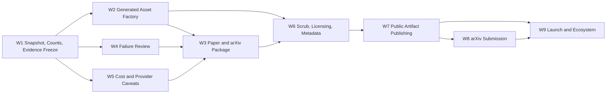

# ObviousBench Layered Release Plan

This is the working release contract for ObviousBench v0.1. It is intended to
stand alone for long-running agents: update the task board, append progress
notes, and keep every release surface tied to generated source artifacts rather
than hand-edited copies.

## Current Release Posture

Recommended launch path: layered release.

1. Artifact layer: public GitHub repository, project page, static report,
   Hugging Face dataset card, GitHub release, Zenodo DOI, and short launch
   essay.
2. Scholarly layer: arXiv technical paper once public URLs, metadata, and
   frozen evidence are aligned.
3. Ecosystem layer: Hugging Face Paper Page, Papers with Code, social launch,
   and later workshop/OpenReview targeting.
4. Future benchmark layer: live public submission leaderboard, hidden split, and
   refresh governance. This is explicitly v0.2+, not a blocker for v0.1.

The center of the release should be a generated asset factory. Counts, paths,
theme tokens, public URLs, copy blocks, chart styling, and release metadata
should live in versioned source-of-truth files. Every surface should be
regenerated from those inputs.

## Current Status Snapshot

- `[x]` Local release config, theme config, surfaces config, asset generator,
  Makefile wiring, and snapshot audit are implemented.
- `[x]` The local release snapshot is frozen to the 223-row/224-question
  paper-v1 artifact set and passes `audit_release_snapshot.py --strict`.
- `[x]` Paper tables, figures, PDF, arXiv source bundle, generated release
  drafts, provenance, and local metadata are generated from release config.
- `[x]` Final-snapshot wrong-answer review now exists:
  `docs/reports/2026-06-03-paper-v1-8x28-current-223-final/wrong-answer-review.csv`
  and `.html`.
- `[x]` Local release verification passes via `make -C paper release-check`.
- `[!]` Public-facing release metadata is still intentionally blocked:
  `audit_public_release_artifacts.py --strict` passes 5/6 checks and fails only
  on final metadata confirmation / endorsement status.
- `[ ]` Actual GitHub, Hugging Face, Zenodo, arXiv, Papers with Code, and social
  publishing steps are not performed in this local-prep pass.

## Tracker Legend

- `[ ]` not started
- `[~]` in progress
- `[x]` complete and verified
- `[!]` blocked or needs user decision

When an agent updates this plan, change the checkbox only when there is evidence
in the repo. Add a dated progress note at the bottom with commands, outputs,
paths, and remaining risk.

## Source Of Truth

### Candidate Frozen Snapshot

Proposed v0.1 public snapshot:

- Release name: `v0.1.0-paper-v1`
- Dataset split: `paper_v1`
- Item panel: 224 questions, from the current 8x28 paper panel
- Model/settings rows: 223 completed rows
- Manifest:
  `results/summaries/paper-v1-8x28-current-223-final-20260603/manifest.csv`
- Comparison directory:
  `results/summaries/paper-v1-8x28-current-223-final-20260603/comparison`
- Report directory:
  `docs/reports/2026-06-03-paper-v1-8x28-current-223-final`
- Effort/cost report:
  `docs/reports/2026-06-02-effort-cost-curves`

This is locally implemented and still requires final human confirmation before
public launch. Public copy must distinguish
"224 questions" from "223 model/settings rows"; those are not interchangeable.

### Known Mismatches To Resolve

- `[x]` `paper/Makefile` targeted the older 234-row 2026-06-02
  evidence run. It must be switched to the frozen v0.1 snapshot through a
  release manifest or generated Makefile include.
- `[x]` Paper prose and generated tables still contained old 234-row and
  80-question language. These claims need regeneration and claim-audit checks.
- `[x]` The current 223-row report did not include
  `wrong-answer-review.csv/html`. The grader review builder needs to support
  multi-root merged manifests or consume an explicit raw-output map.
- `[!]` Anthropic thinking/cost language must be conservative. The Opus 4.8
  diagnosis found that request shape, summary-token telemetry, and repricing
  have changed across generations. Do not publish claims that equate reported
  reasoning tokens with billed hidden thinking unless the current run supports
  that exact claim.
- `[!]` Public URLs, DOI, final title, author list, license choices, and arXiv
  endorsement status are still release decisions, not implementation details.

## Execution Topology

The release work should be executed as checkpointed lanes, not as one large
mutable thread. Lanes may run in parallel only when they do not write the same
files and their inputs are already stable.

### Coordination Rules

- One agent owns this tracker at a time. Other agents append progress notes in
  their assigned section but do not reorder milestones.
- Each agent begins with `git status --short` and records any files it intends
  to touch before editing.
- Agents do not hand-edit generated artifacts. They change config, source
  generators, or source prose, then regenerate.
- Agents mark a task `[x]` only after writing the evidence command and result in
  a progress note.
- Agents stop and report if they find a new stale snapshot, mismatched count,
  missing source artifact, secret-shaped value, or unsupported public claim.
- Public publishing steps require an explicit human checkpoint even if local
  artifacts are already generated.

### Checkpoint Gates

| Gate | Purpose | Required command or evidence | Blocks |
| --- | --- | --- | --- |
| G0 Snapshot Freeze | Confirms one evidence source | `scripts/audit_release_snapshot.py --config configs/release_v0_1_0.yaml --strict` exits 0 | paper, site, release copy |
| G1 Generated Asset Contract | Ensures assets are config-driven | `make -C paper release-assets` exits 0 and `docs/release/generated/provenance.json` exists | manual copy review |
| G2 Result Integrity | Confirms final 223-row artifact set | `make -C paper result-artifacts` exits 0 | paper claims, leaderboard release |
| G3 Failure Review | Confirms diagnostic review exists | `wrong-answer-review.csv` and `.html` exist; row counts recorded | failure-analysis claims |
| G4 Paper Package | Confirms local paper package | `make -C paper pdf` and `make -C paper release-package` exit 0 | arXiv upload |
| G5 Local Release Check | Confirms all local non-public gates | `make -C paper release-check` exits 0 | public artifact publish |
| G6 Public Metadata | Confirms live public fields | `scripts/audit_public_release_artifacts.py --strict` exits 0 | arXiv final metadata |
| G7 External Publish Smoke | Confirms published surfaces resolve | clean-browser URL smoke with links recorded | ecosystem indexing |

### Parallel Lanes

| Lane | Can Run In Parallel With | Must Wait For | Primary Outputs | Merge Checkpoint |
| --- | --- | --- | --- | --- |
| L1 Snapshot and Generated Assets | L3, L4 after G0 | none | release config, generators, provenance | G1 and G2 |
| L2 Paper and arXiv Package | L5 after G1 | G0, G1 | paper PDF, source bundle, claim ledger | G4 |
| L3 Failure Review and Diagnostics | L1 after manifest exists | G0 | wrong-answer review CSV/HTML | G3 |
| L4 Release Scrub and Licensing | L1, L3 | G0 | scrub note, ignore proof, license audit | G5 precheck |
| L5 Public Copy Surfaces | L4 partial, L6 planning | G1, G2 | README blocks, dataset card, project page, release notes | G5 |
| L6 Publication Operations | none until local prep passes | G5, human URL decisions | live GitHub/HF/Zenodo/arXiv surfaces | G6 and G7 |
| L7 Ecosystem and Post-Launch | public smoke only | G7, arXiv ID | HF Paper Page, Papers with Code, launch notes | post-launch audit |

If two lanes need the same file, the later lane must rebase its work on the
earlier lane's generated output and rerun that lane's merge checkpoint.

### Block Readiness Matrix

Use this table before dispatching subagents. A block is claimable only when its
ready signal is true and no other active agent owns its file scope.

| Block | Ready Signal | Completion Signal | Parallel Safety |
| --- | --- | --- | --- |
| W0 Coordination | Always ready | Tracker statuses match progress notes and blockers | Single-writer on this plan |
| W1 Snapshot | Release candidate paths exist locally | G0 passes and counts are recorded | Read-only for other lanes after freeze |
| W2 Assets | W1 snapshot selected | G1 passes; provenance has input/output hashes | Parallel with W3/W4/W6 after generated interfaces stabilize |
| W3 Paper | W1 and W2 pass | G4 passes; figure audit guards placeholders | Parallel with W4/W5, but single-writer on `paper/` |
| W4 Failure Review | W1 manifest exists | G3 passes; review row counts recorded | Parallel with W2/W3 if it avoids `paper/` |
| W5 Cost/Effort | W1 manifest exists | Cost audit and missing-point audit pass | Parallel with W3 if graph generator ownership is clear |
| W6 Scrub/Metadata | W1 and W2 pass | Public audit passes or names only human/public blockers | Parallel with W3-W5, but single-writer on metadata files |
| W7 Public Publish | W1-W6 local gates pass and human approval recorded | G6 passes with live URLs | Sequential only |
| W8 arXiv | W3/W6/W7 pass and arXiv account is ready | arXiv ID captured and surfaces regenerated | Submission is sequential only |
| W9 Ecosystem | W7 live URLs exist; W8 needed for arXiv-linked pages | G7/post-launch audit passes | Drafting can parallelize; publishing is sequential |

### Ownership Lock Protocol

- A subagent claims a block by appending a short progress note before editing:
  block, intended files, expected validation bundle, and expected next handoff.
- A claimed block owns only the files listed under that block. If it must touch
  another file, it adds a note before doing so and reruns both affected bundles.
- Generated-output owners own the generator/config, not the generated file. The
  generated file may be rewritten only by the relevant command.
- Any agent that finds a stale snapshot reference, private-data risk, or
  unsupported public claim pauses its block and records a blocker instead of
  continuing adjacent cleanup.
- Public actions are never claimed implicitly. They require an explicit
  approval note naming the exact URL, title, metadata, and rollback path.

### Acceptance Criteria Template

Every lane completion note must include:

- Scope: exact files changed or generated.
- Evidence: exact command, exit status, and concise output summary.
- Artifact links: local paths to the files a reviewer should inspect.
- Risk: one sentence naming what was not verified.
- Next handoff: the next lane or checkpoint that can now proceed.

Example completion note shape:

```text
Lane L3 complete. Changed scripts/build_grader_review.py and
obviousbench/research/grader_review.py; generated
docs/reports/.../wrong-answer-review.csv and .html. Verified with
pytest tests/research/test_grader_review.py -q (3 passed) and
make -C paper release-check (exit 0). Risk: raw log paths are still fragmented,
so this release uses summary-gallery review as the reproducible source.
Next handoff: L2 can regenerate failure_type_summary.tex.
```

## Discrete Work Blocks For Subagents

These blocks are the release execution units. A subagent may claim one block, or
one narrow checklist item inside a block, and should not modify files outside
the stated scope unless it first records the reason in progress notes.

### W0: Release Coordination And Tracker Hygiene

Status: `[~]`

Lane: cross-lane coordination.

Can run in parallel with: all blocks, as long as it edits only this plan.

Dependencies: none.

Files in scope:

- `docs/research/2026-06-03-obviousbench-layered-release-plan.md`

Checkpoints:

- `[ ]` Confirm each active subagent has one claimed block and one file scope.
- `[ ]` Confirm no two agents are writing the same generated source file.
- `[ ]` Reconcile completed progress notes with checkbox status once per major
  gate.
- `[ ]` Preserve a single release snapshot identity across all handoffs.

Acceptance criteria:

- `[ ]` Every completed block has a dated progress note with evidence.
- `[ ]` Any blocked block has a named blocker, owner, and next decision.
- `[ ]` No public-publishing block is marked complete before human approval.

Stop conditions:

- A subagent changes the frozen snapshot path, count, title, URL policy, or
  public claim without updating this tracker.

### W1: Snapshot, Counts, And Evidence Freeze

Status: `[x]` locally verified; public launch still requires human confirmation.

Lane: L1.

Can run in parallel with: W3 and W4 after the initial manifest is identified.

Dependencies: none.

Files in scope:

- `configs/release_v0_1_0.yaml`
- `scripts/audit_release_snapshot.py`
- `tests/research/test_release_snapshot.py`
- selected final manifest/report paths under `results/summaries/` and
  `docs/reports/`

Checkpoints:

- `[x]` Select the exact 223-row/224-question final snapshot.
- `[x]` Encode the selected paths and counts in release config.
- `[x]` Reject old 234-row/80-question evidence paths in release-active
  surfaces.
- `[x]` Record the distinction between item count and model/settings row count.

Acceptance criteria:

- `[x]` `.venv/bin/python scripts/audit_release_snapshot.py --config configs/release_v0_1_0.yaml --strict`
  exits 0.
- `[x]` `pytest tests/research/test_release_snapshot.py -q` passes.
- `[ ]` Human reviewer confirms the frozen snapshot is the one to publish.

Stop conditions:

- Any current public surface uses a different manifest, different count, or
  old evidence path without an explicit historical label.

### W2: Generated Asset Factory

Status: `[x]` locally implemented and release-check verified.

Lane: L1.

Can run in parallel with: W3, W4, W6 after W1 passes.

Dependencies: W1.

Files in scope:

- `configs/release_theme_v0_1_0.yaml`
- `configs/release_surfaces_v0_1_0.yaml`
- `scripts/build_release_assets.py`
- `obviousbench/research/release_snapshot.py`
- `docs/release/generated/`
- `paper/release.mk`

Checkpoints:

- `[x]` One command generates release drafts and provenance.
- `[x]` Generated paths are controlled by `release_surfaces_v0_1_0.yaml`.
- `[x]` Paper Makefile consumes generated release variables.
- `[x]` Effort-cost chart paths, model colors, effort line styles, axis labels,
  and web styling are read from release/theme config and covered by a
  regression test.
- `[x]` Root `CITATION.cff` and `.zenodo.json` are generated from release config.

Acceptance criteria:

- `[x]` `.venv/bin/python scripts/build_release_assets.py --config configs/release_v0_1_0.yaml`
  exits 0 and writes `docs/release/generated/provenance.json`.
- `[x]` `make -C paper release-assets` exits 0.
- `[x]` Provenance records input hashes, output hashes, command, git commit, and
  dirty-worktree status.

Stop conditions:

- A generated artifact needs manual edits to correct release counts, URLs,
  caveats, labels, or colors.

### W3: Paper, Figures, And arXiv Package

Status: `[x]` locally packaged with non-placeholder, guideline-aligned figures.

Lane: L2.

Can run in parallel with: W4, W5, W6 after W1 and W2 pass.

Dependencies: W1, W2.

Files in scope:

- `paper/`
- `obviousbench/research/paper_assets.py`
- `scripts/build_paper_assets.py`
- `scripts/audit_paper_claims.py`
- `scripts/audit_paper_source.py`
- `scripts/audit_paper_pdf.py`
- `scripts/audit_arxiv_source_bundle.py`
- `tests/research/test_paper_assets.py`

Checkpoints:

- `[x]` Paper prose uses 224 questions and 223 model/settings rows.
- `[x]` Tables and existing figures are regenerated from release config.
- `[x]` PDF builds without release-blocking audit failures.
- `[x]` arXiv source bundle is generated and audited.
- `[x]` Figure 1 is regenerated as an all-row answer-correctness distribution
  with representative high-scoring rows.
- `[x]` Figure 2 is regenerated as an aggregate model-family by task-family
  heatmap over the full evidence snapshot.
- `[x]` PDF audit fails on missing, tiny, or placeholder standalone figures.

Acceptance criteria:

- `[x]` `make -C paper pdf` exits 0.
- `[x]` `make -C paper release-package` exits 0.
- `[x]` `.venv/bin/python scripts/audit_paper_pdf.py` exits 0.
- `[x]` `.venv/bin/python scripts/audit_arxiv_source_bundle.py --bundle paper/arxiv-src.tar.gz --out docs/research/2026-06-03-obviousbench-arxiv-source-bundle-audit.md`
  exits 0.
- `[ ]` Final title, author list, comments, license, and arXiv category are
  confirmed by a human reviewer.

Stop conditions:

- The arXiv-processed PDF differs materially from `paper/main.pdf`, or paper
  claims rely on unpublished/publicly unresolved URLs.

### W4: Failure Review And Grader Diagnostics

Status: `[x]` locally generated from summary galleries.

Lane: L3.

Can run in parallel with: W2, W3, W5 after W1 passes.

Dependencies: W1.

Files in scope:

- `obviousbench/research/grader_review.py`
- `scripts/build_grader_review.py`
- `tests/research/test_grader_review.py`
- `docs/reports/2026-06-03-paper-v1-8x28-current-223-final/wrong-answer-review.csv`
- `docs/reports/2026-06-03-paper-v1-8x28-current-223-final/wrong-answer-review.html`

Checkpoints:

- `[x]` Recreate final-snapshot wrong-answer review without hand stitching.
- `[x]` Record row counts and warning counts.
- `[x]` Link the review from release-generated report surfaces where
  configured.
- `[ ]` Decide whether deeper raw-output diagnostics are needed for the paper
  or can remain an internal follow-up.

Acceptance criteria:

- `[x]` `.venv/bin/python scripts/build_grader_review.py --help` shows the
  release-supported inputs.
- `[x]` `pytest tests/research/test_grader_review.py -q` passes.
- `[x]` Final CSV/HTML exist and row counts are recorded in progress notes.

Stop conditions:

- A failure-analysis claim requires raw output evidence that the generated
  summary-gallery review cannot support.

### W5: Cost, Effort, And Provider Caveat Integrity

Status: `[x]` local graph/cost gate passes; final public placement remains a
human editorial decision.

Lane: L1/L3 shared diagnostic lane.

Can run in parallel with: W3 and W6 after W1 passes.

Dependencies: W1.

Files in scope:

- `scripts/audit_cost_integrity.py`
- effort/cost graph generator scripts
- `docs/reports/2026-06-02-effort-cost-curves/`
- Anthropic request-path diagnosis notes under `docs/research/`

Checkpoints:

- `[x]` Confirm final manifest cost-integrity audit passes.
- `[x]` Confirm effort/cost figures use answer correctness on y-axis unless the
  caption explicitly names strict or format-only scoring.
- `[x]` Confirm OpenAI none/low grouped-by-setting graph includes GPT-5.4 mini.
- `[x]` Confirm Anthropic charts and captions do not imply hidden-thinking cost
  precision unsupported by telemetry.
- `[ ]` Decide whether cost curves appear in paper, appendix, project site, or
  launch essay only.

Acceptance criteria:

- `[x]` `.venv/bin/python scripts/audit_cost_integrity.py --manifest results/summaries/paper-v1-8x28-current-223-final-20260603/manifest.csv`
  exits 0.
- `[x]` Missing-point audit for effort/cost graphs is empty except header, or
  every missing point has a documented reason.
- `[x]` Captions and footnotes distinguish configured reasoning settings,
  reported tokens, estimated price, and billed hidden thinking.

Stop conditions:

- A provider-specific graph shows a surprising cost/effort inversion that is
  not explained by telemetry, request-shape audit, or explicit caveat.

### W6: Public Scrub, Licensing, And Metadata

Status: `[!]` blocked on public-facing metadata confirmation / endorsement
status.

Lane: L4/L5.

Can run in parallel with: W3, W4, W5 after W1 passes.

Dependencies: W1, W2.

Files in scope:

- `README.md`
- `LICENSE*`
- `CITATION.cff`
- `.zenodo.json`
- `docs/release/generated/`
- `.gitignore`
- release packaging and public-release audit scripts

Checkpoints:

- `[x]` Fallback secret/private-surface scan found no literal token-shaped
  secrets in release-active files.
- `[x]` Representative raw provider logs are ignored by Git.
- `[x]` Dedicated secret scanner result is recorded, or absence is documented
  with fallback commands.
- `[x]` Local license choice for code and docs/data is encoded in
  `configs/release_v0_1_0.yaml`, `LICENSE`, and `LICENSE-DATA-DOCS.md`.
- `[!]` Final public URLs, DOI policy, title/abstract, submitter authorization,
  and arXiv endorsement are not confirmed. Endorsement is required for both
  `cs.CL` and `cs.AI`; unique endorsement codes must stay out of Git/docs.

Acceptance criteria:

- `[ ]` `.venv/bin/python scripts/audit_public_release_artifacts.py --strict`
  exits 0.
- `[x]` `git check-ignore -v` evidence exists for representative private output
  trees.
- `[x]` A clean public-reader path exists that does not require provider API
  credentials.

Stop conditions:

- A release-active file contains credentials, private account identifiers,
  non-public raw material, or unresolved metadata placeholders.

### W7: Public Artifact Publishing

Status: `[ ]` not started; requires explicit human approval.

Lane: L6.

Can run in parallel with: none while publishing; publish sequentially to avoid
URL drift.

Dependencies: W1 through W6 local gates.

Files in scope:

- release config URL fields
- GitHub release assets
- project site/static report deploy target
- Hugging Face dataset repository
- Zenodo archive
- regenerated public README/site/card/citation surfaces

Checkpoints:

- `[ ]` Publish or confirm canonical GitHub repository URL.
- `[ ]` Publish project site/static report and smoke links.
- `[ ]` Publish Hugging Face dataset card.
- `[ ]` Create GitHub release and attach generated assets/checksums.
- `[ ]` Create Zenodo DOI and update release config.
- `[ ]` Regenerate all public surfaces with live URLs.

Acceptance criteria:

- `[ ]` Clean browser session resolves every canonical public URL.
- `[ ]` `scripts/audit_public_release_artifacts.py --strict` exits 0 after live
  URLs are present.
- `[ ]` Release notes, README, dataset card, site, citation, and paper metadata
  agree on version, title, counts, DOI, and canonical links.

Stop conditions:

- Any public URL cannot be edited after publication but contains stale counts,
  stale links, unsupported claims, or private material.

### W8: arXiv Submission Operations

Status: `[ ]` not started; requires public artifact layer first.

Lane: L6.

Can run in parallel with: W9 drafting only; actual submission is sequential.

Dependencies: W3, W6, W7.

Files in scope:

- `paper/arxiv-src.tar.gz`
- arXiv metadata handoff notes
- release config arXiv fields
- regenerated citation/public surfaces after arXiv ID exists

Checkpoints:

- `[ ]` Confirm arXiv account, endorsement, categories, license, comments, and
  AI-tool disclosure.
- `[ ]` Upload source bundle and inspect arXiv-processed PDF.
- `[ ]` Submit before 14:00 US Eastern when feasible.
- `[ ]` Capture arXiv ID after announcement.
- `[ ]` Regenerate public surfaces with arXiv ID.

Acceptance criteria:

- `[ ]` arXiv-processed PDF is visually inspected and materially matches local
  PDF.
- `[ ]` All public citation surfaces include arXiv link after announcement.

Stop conditions:

- arXiv endorsement, moderation, source processing, or metadata mismatch blocks
  submission.

### W9: Launch Copy, Ecosystem Indexing, And Post-Launch Ops

Status: `[~]` drafts exist locally; publishing not started.

Lane: L7.

Can run in parallel with: W8 metadata wait after W7 publishes.

Dependencies: W7, then W8 for arXiv-linked ecosystem surfaces.

Files in scope:

- generated launch essay and social snippets
- Hugging Face Paper Page checklist
- Papers with Code checklist
- GitHub Discussions/issues templates
- correction protocol notes

Checkpoints:

- `[x]` Local launch essay and social snippets are generated as drafts.
- `[ ]` HF Paper Page points to arXiv, dataset, GitHub, and project site.
- `[ ]` Papers with Code task/dataset/result metadata is submitted.
- `[ ]` Public issue/discussion intake path exists.
- `[ ]` Seven-day post-launch monitoring owner is named.

Acceptance criteria:

- `[ ]` Every public copy block links to the canonical project URL and uses the
  same caveats as the paper.
- `[ ]` No launch copy makes unsupported ranking, human-baseline, hidden-cost,
  or contamination-resistance claims.
- `[ ]` A patch-release/correction protocol is visible to readers.

Stop conditions:

- A launch surface forces stale or over-broad claims that cannot be edited after
  publication.

## Review Cadence And Handoff Protocol

- During local prep, run a checkpoint review at the end of each W-block or at
  least once per half day of agent work.
- During public publishing, stop after each irreversible external action and
  record the live URL before continuing.
- Every handoff note must include the next valid command a reviewer should run.
- A reviewer should prefer one broad gate command, usually
  `make -C paper release-check`, after any cross-surface change.
- Public gates G6 and G7 require a human go/no-go because they involve names,
  URLs, DOI, metadata, and reputational claims that are not purely technical.

### Local Checkpoint Form

```text
Checkpoint:
Block:
Agent:
Files changed:
Files generated:
Commands run:
Exit statuses:
Key outputs:
Reviewer should inspect:
Known residual risk:
Next valid command:
Next owner/block:
```

### Public Checkpoint Form

```text
Public checkpoint:
External action proposed:
Irreversible or hard-to-edit fields:
Exact metadata to publish:
Canonical URL expected:
Rollback/correction path:
Human approval recorded:
Post-action smoke command:
Post-action surfaces to regenerate:
```

### Validation Bundles

Use the smallest bundle that matches the change. If a bundle fails, the owning
agent fixes source/config first and does not weaken checks.

| Bundle | When to run | Commands |
| --- | --- | --- |
| Snapshot-only | Release config, paths, counts | `.venv/bin/python scripts/audit_release_snapshot.py --config configs/release_v0_1_0.yaml --strict` and `pytest tests/research/test_release_snapshot.py -q` |
| Generated-assets | Config, surfaces, copy, theme | `.venv/bin/python scripts/build_release_assets.py --config configs/release_v0_1_0.yaml` and inspect `docs/release/generated/provenance.json` |
| Paper package | Paper prose, tables, figures, arXiv bundle | `make -C paper pdf`, `make -C paper release-package`, `.venv/bin/python scripts/audit_paper_pdf.py`, `.venv/bin/python scripts/audit_arxiv_source_bundle.py --bundle paper/arxiv-src.tar.gz --out docs/research/2026-06-03-obviousbench-arxiv-source-bundle-audit.md` |
| Failure review | Grader diagnostics or report review | `pytest tests/research/test_grader_review.py -q` and regenerate `wrong-answer-review.csv/html` |
| Cost integrity | Cost/pricing/effort graph changes | `.venv/bin/python scripts/audit_cost_integrity.py --manifest results/summaries/paper-v1-8x28-current-223-final-20260603/manifest.csv` plus the effort-curve missing-point audit |
| Full local release | Cross-surface or pre-public checkpoint | `make -C paper release-check` |
| Public release | Live URLs, DOI, repository, HF, arXiv metadata | `.venv/bin/python scripts/audit_public_release_artifacts.py --strict` plus clean-browser URL smoke |

### Validation Escalation Rules

- If a change touches only this plan, run the plan self-review scan and
  `git diff -- docs/research/2026-06-03-obviousbench-layered-release-plan.md`.
- If a change touches release config, surfaces config, theme config, generated
  metadata, or paper Makefile targets, run the Generated-assets and Full local
  release bundles.
- If a change touches comparison inputs, manifests, costs, model panels, or
  effort/cost graphs, run Snapshot-only, Cost integrity, and Full local release
  bundles.
- If a change touches `paper/`, paper assets, figure generation, paper audits,
  or arXiv packaging, run Paper package and Full local release bundles.
- If a change touches public copy, license metadata, citation metadata, URLs,
  DOI, or arXiv metadata, run Public release audit even if it is expected to
  fail on human-only fields; record the exact remaining failed fields.
- If a verification command fails, the progress note records the failing
  command, exit status, and first actionable failure before any fix attempt.

### Subagent Dispatch Template

```text
You are working in /Users/adamallcock/Documents/Coding/benchmark-oops.
Claim exactly one work block from
docs/research/2026-06-03-obviousbench-layered-release-plan.md.

Block:
Allowed files:
Do not edit generated outputs directly. Change source config/generator/prose and
regenerate.
Begin by running git status --short and recording intended files.
Before marking done, run the validation bundle named in the block and append a
dated progress note using the Local Checkpoint Form.
Stop immediately if you find stale 234-row evidence, mixed 224/223 counts,
secret-shaped values, unsupported Anthropic hidden-thinking claims, or public
metadata placeholders in release-active surfaces.
Do not publish external artifacts or call provider APIs without explicit human
approval.
```

## Dependency Graph



## Risk Register

| Risk | Impact | Mitigation | Owner/Gate |
| --- | --- | --- | --- |
| Snapshot drift back to 234-row artifacts | Invalid paper/report claims | Release config plus strict snapshot audit | W1/G0 |
| Public counts mix questions and model/settings rows | Reader confusion and credibility loss | Generate counts from one metadata object | W1/G1 |
| Generated assets require hand edits | Release becomes brittle and slow | Fix generators/config; provenance manifest required | W2/G1 |
| Anthropic hidden-thinking costs overclaimed | Misleading provider comparison | Conservative captions, telemetry caveat, cost audit | W5/G2 |
| GPT-5.4 mini low or another expected point drops out | Broken model-size story | Missing-point audit and block graph publish until explained | W5/G2 |
| Private provider logs or secrets leak | Security/privacy incident | Secret scan, ignore audit, staged-file inspection | W6/G5 |
| Metadata mismatch across GitHub/HF/Zenodo/arXiv | Citation and indexing confusion | Public metadata audit after live URLs | W6-W8/G6 |
| arXiv processing changes the PDF | Broken scholarly artifact | Inspect processed PDF before final submission | W8/G7 |
| Launch copy overstates benchmark scope | Reputational damage | Generated caveats and claim discipline review | W9/G7 |

## Release Asset Factory

### Goal

A theme or snapshot change should require edits in one or two source files, then
one regeneration command. No graph, README table, arXiv metadata block, dataset
card, or release note should need manual repair after a snapshot change.

### Implemented Source Files

- `[x]` `configs/release_v0_1_0.yaml`
  - release id, version, title, short name, canonical slug
  - dataset split paths and item/model counts
  - selected result manifest, comparison directory, report directory, effort
    curve directory
  - public URLs, DOI, arXiv ID, HF dataset repo, GitHub release tag
  - claim limits and caveats
  - component enable/disable flags
- `[x]` `configs/release_theme_v0_1_0.yaml`
  - palette, provider colors, model-family colors, line styles, chart
    typography, axis defaults, logo paths, accessibility constraints
  - print and web variants if needed
- `[x]` `configs/release_surfaces_v0_1_0.yaml`
  - target file paths for generated README blocks, paper tables, paper figures,
    project site, HF card, Zenodo metadata, launch post, and release notes
  - ownership and review status for each surface
- `[x]` `docs/release/generated/README.md`
  - generated asset index with checksums, source inputs, build command, and
    timestamp

### Implemented Commands

- `[x]` `.venv/bin/python scripts/build_release_assets.py --config configs/release_v0_1_0.yaml`
  - generates all configured release artifacts
  - writes a checksum/provenance manifest
  - refuses to run if required snapshot inputs are missing
- `[x]` `.venv/bin/python scripts/audit_release_snapshot.py --config configs/release_v0_1_0.yaml --strict`
  - validates counts, stale path references, missing generated assets, public
    URL placeholders, and source/report consistency
- `[x]` `make release-assets`
  - wrapper around `build_release_assets.py`
- `[x]` `make release-check`
  - runs snapshot audit, result-artifact audit, cost-integrity audit, paper
    claim audit, paper source audit, public release audit, and PDF audit
- `[x]` `make release-package`
  - generates the arXiv source bundle, GitHub release asset bundle, checksums,
    and release handoff packet

### Generated Asset Policy

- `[x]` Every generated Markdown, TeX, CSV, SVG, PNG, HTML, and metadata file
  has a short header or adjacent manifest entry naming its source config and
  build command.
- `[x]` Generated files are not edited by hand. If a chart label, theme color,
  caption, title, caveat, or count is wrong, change the config or generator.
- `[x]` Chart colors come from `release_theme_v0_1_0.yaml`; individual scripts
  do not carry their own palettes.
- `[x]` All generated visual outputs include both vector and bitmap variants
  when practical: PDF/SVG for paper and PNG for web/social previews.
- `[x]` All copy that repeats counts, URLs, titles, caveats, or citation text is
  generated from one release metadata object.
- `[x]` The release build writes a machine-readable provenance file with input
  hashes, output hashes, command, git commit, dirty-worktree status, Python
  dependency-file hashes, and whether Python lockfiles are present.

## Release Surfaces And Components

| Surface | Purpose | Generated inputs | Status |
| --- | --- | --- | --- |
| Root README | First public entrypoint, quickstart, citation, links, scope limits | release config, benchmark card, report links | `[!]` public review/publish pending |
| Benchmark card | Methodology, intended use, exclusions, scoring policy, limitations | release config, scoring policy docs | `[ ]` |
| Dataset card | HF dataset discoverability, data statement, bias/limits, license | split metadata, item cards, release config | `[x]` draft generated |
| Project site | Canonical public page with static leaderboard and report links | release config, report HTML, generated charts | `[x]` draft generated |
| Static report | Detailed model/settings results and failure review | frozen comparison artifacts | `[x]` local report complete |
| Paper PDF | Scholarly manuscript | generated paper tables/figures, claim ledger | `[x]` local PDF built |
| arXiv source bundle | Submission package | paper source, generated assets, metadata | `[x]` local bundle audited |
| GitHub release | Versioned code/data snapshot | release notes, checksums, source archives | `[x]` notes generated, publish pending |
| Zenodo metadata | DOI archive | `.zenodo.json`, CITATION, release metadata | `[x]` generated draft, DOI pending |
| CITATION.cff | Citation and discoverability | release metadata, DOI/arXiv once available | `[x]` generated draft, DOI/arXiv pending |
| Launch essay | Accessible narrative and caveats | release config, selected figures, links | `[x]` draft generated |
| Social snippets | Distribution without overclaiming | generated short links and image cards | `[x]` draft generated |
| HF Paper Page | Paper/artifact linkage after arXiv | arXiv ID, HF dataset, GitHub URL | `[ ]` |
| Papers with Code | Benchmark indexing after arXiv | arXiv ID, task/dataset/result metadata | `[ ]` |
| Repro package | One-command audit and reproduction handoff | release config, manifest, scripts | `[x]` local `release-check` and package pass |

### Current Publishable Artifact Map

Use this map when asking "what are we actually publishing?" The generated
drafts are the local source of truth until public URLs, DOI, and arXiv ID exist.

| Artifact | Local path | Intended destination | Status |
| --- | --- | --- | --- |
| Paper PDF | `paper/main.pdf` | arXiv PDF / website download | local build complete |
| arXiv source bundle | `paper/arxiv-src.tar.gz` | arXiv upload package | local bundle audited |
| Main result report | `docs/reports/2026-06-03-paper-v1-8x28-current-223-final/report.html` | website/static report | local report complete |
| Effort/cost report | `docs/reports/2026-06-02-effort-cost-curves/index.html` | website or appendix, placement TBD | draft/diagnostic |
| Release asset index | `docs/release/generated/README.md` | maintainer handoff | generated |
| Project page copy | `docs/release/generated/project-page.md` | `https://obviousbench.com` | draft generated |
| Launch essay | `docs/release/generated/launch-essay-draft.md` | blog/launch post | draft generated |
| Social snippets | `docs/release/generated/social-snippets.md` | launch posts | draft generated |
| GitHub release notes | `docs/release/generated/github-release-notes.md` | GitHub release | draft generated |
| Dataset card | `docs/release/generated/huggingface-dataset-card.md` | Hugging Face dataset | draft generated; dataset URL TBD |
| arXiv metadata draft | `docs/release/generated/arxiv-metadata-draft.md` and `docs/research/2026-06-01-obviousbench-arxiv-submission-metadata.md` | arXiv submission form | blocked on endorsement and final URLs |
| Citation metadata | `CITATION.cff` | GitHub / Zenodo / citation tooling | generated draft |
| Zenodo metadata | `.zenodo.json` | Zenodo archive metadata | generated draft; DOI pending |
| Provenance manifest | `docs/release/generated/provenance.json` | maintainer/repro evidence | generated |

## Milestones

### M0: Freeze Snapshot And Claims

Target duration: 0.5 to 1 day.

- `[x]` Confirm local release config uses the 223-row/224-question snapshot.
- `[x]` Write a one-paragraph release claim with allowed and disallowed claims.
- `[x]` Record exact item count, model/settings row count, provider count,
  scoring metric, and date range.
- `[!]` Decide final public language for Anthropic effort/cost curves.
- `[ ]` Decide whether effort/cost curves are main-paper, appendix, project-site
  only, or launch-essay-only.
- `[x]` Human baseline is excluded for v0.1; no human baseline is planned.

Definition of done:

- `[x]` Release snapshot has one name and one manifest path.
- `[x]` No local release-generated surface can mix 234-row/80-question copy with
  223-row/224-question evidence.
- `[x]` Known caveats are explicit and reusable in generated copy.
- `[ ]` Human reviewer confirms those local claims are the public launch claims.

### M1: Build The Release Asset Factory

Target duration: 1 to 2 days.

- `[x]` Add release config, theme config, and surfaces config.
- `[x]` Add `build_release_assets.py` as the orchestration entrypoint.
- `[x]` Add `audit_release_snapshot.py` for stale-path and count checks.
- `[x]` Teach `paper/Makefile` to read generated release variables or a single
  generated include file.
- `[x]` Route paper assets, effort-cost charts, report cards, launch images,
  dataset cards, and release notes through the release config.
- `[x]` Add generated-asset headers or provenance manifest entries.
- `[x]` Add tests for config validation, stale evidence detection, and generated
  output paths.

Definition of done:

- `[x]` Changing the release title, selected manifest, or chart palette in config
  changes all downstream generated surfaces.
- `[x]` A release build fails loudly when old evidence paths or placeholder URLs
  remain.

### M2: Regenerate Paper, Report, And Static Assets

Target duration: 1 to 2 days after M1.

- `[x]` Switch paper evidence to the frozen snapshot through config.
- `[x]` Regenerate paper tables and figures from the current comparison data.
- `[x]` Update paper prose for 224 questions and 223 model/settings rows.
- `[x]` Regenerate Figure 1 and Figure 2 following the figure/table guidelines:
  distribution/frontier over top-only saturation, and aggregate family/task
  summaries over hand-picked rows.
- `[x]` Regenerate cost/frontier assets using answer correctness on the y-axis
  unless the caption explicitly states strict or format-only scoring.
- `[x]` Generate wrong-answer review for the merged 223-row snapshot.
- `[x]` Generate a release report index that links leaderboard, family heatmap,
  failure review, cost curves, and provenance.
- `[x]` Rebuild `paper/main.pdf` and `paper/arxiv-src.tar.gz`.

Definition of done:

- `[x]` Paper tables, figure captions, report summary, and release notes agree on
  counts and snapshot.
- `[x]` Figure PDF/SVG files are non-placeholder and visually inspectable.
- `[x]` Failure review exists for the final snapshot or is explicitly removed
  from all launch claims.

### M3: Public Repo And Artifact Scrub

Target duration: 0.5 to 1 day.

- `[x]` Inspect dirty worktree and split unrelated work from release work.
- `[x]` Confirm public/private boundary for generated reports, provider logs,
  raw model outputs, secrets, and source material.
- `[x]` Run secret scan and representative `git check-ignore -v` checks for
  generated/private output trees. Fallback scan completed; dedicated scanner was
  unavailable in the local environment.
- `[x]` Confirm local license metadata: code is Apache-2.0 and docs/data are
  CC BY 4.0 pending final public confirmation.
- `[x]` Confirm `CITATION.cff`, `.zenodo.json`, `LICENSE`, `LICENSE-DATA-DOCS.md`,
  and release metadata agree.
- `[x]` Build a minimal reproduction path that does not require private API
  credentials for inspecting existing artifacts.

Definition of done:

- `[x]` A public reader can understand, cite, and inspect the snapshot without
  private credentials.
- `[x]` No private keys, account identifiers, or non-public raw material are
  staged for release; no files were staged in this pass.

### M4: Publish Artifact Layer

Target duration: 0.5 to 1 day after scrub.

- `[ ]` Publish or confirm public GitHub repository URL.
- `[ ]` Publish project page/static site.
- `[ ]` Publish Hugging Face dataset repo and dataset card.
- `[ ]` Create `v0.1.0-paper-v1` GitHub release with generated release notes.
- `[ ]` Archive the GitHub release through Zenodo and capture DOI.
- `[ ]` Update release config with live URLs and DOI.
- `[ ]` Regenerate README, site, citation blocks, launch essay, and arXiv
  metadata with live URLs.

Definition of done:

- `[ ]` Public URLs resolve in a clean browser session.
- `[ ]` DOI is live or explicitly tracked as pending with a retry step.
- `[ ]` Artifact layer is independently useful even before arXiv announcement.

### M5: Submit arXiv

Target duration: 0.5 day active work, plus arXiv moderation/endorsement time.

- `[ ]` Obtain arXiv endorsement. Endorsement is required for `cs.CL` and
  `cs.AI`; unique endorsement codes must stay out of Git/docs.
- `[ ]` Confirm title, abstract, authors, categories, license, comments, and
  AI-tool disclosure.
- `[ ]` Run arXiv source bundle audit and PDF audit.
- `[ ]` Upload source bundle and inspect arXiv-processed PDF.
- `[ ]` Submit before 14:00 US Eastern when possible.
- `[ ]` Record arXiv ID after announcement.
- `[ ]` Regenerate public surfaces with the arXiv ID.

Definition of done:

- `[ ]` arXiv PDF matches local PDF materially.
- `[ ]` Project site, README, HF card, citation, and launch post include arXiv
  link after announcement.

### M6: Ecosystem Launch

Target duration: 0.5 to 1 day after arXiv ID.

- `[ ]` Claim or link Hugging Face Paper Page.
- `[ ]` Submit Papers with Code task/dataset/result pages.
- `[ ]` Publish launch essay.
- `[ ]` Publish social snippets with canonical project URL and no unsupported
  ranking claims.
- `[ ]` Open GitHub Discussions or issue templates for corrections and model
  requests.
- `[ ]` Record post-launch questions, corrections, and follow-up tasks.

Definition of done:

- `[ ]` All ecosystem pages point back to the same canonical release.
- `[ ]` The launch narrative has one clear claim and visible caveats.

### M7: Post-Launch Operations And v0.2 Planning

Target duration: starts immediately after launch.

- `[ ]` Monitor GitHub issues and correction reports for seven days.
- `[ ]` Publish corrections as patch releases if needed.
- `[ ]` Define live leaderboard governance before accepting public submissions.
- `[ ]` Specify hidden/test split policy, refresh cadence, provider drift policy,
  API-cost handling, and anti-overfitting posture.
- `[ ]` Draft workshop/OpenReview target list and submission calendar.

Definition of done:

- `[ ]` v0.1 has a stable archival record.
- `[ ]` v0.2 live-leaderboard work has a separate plan and does not mutate the
  v0.1 paper snapshot.

## Verification Gates

Run these gates before calling the release ready. Add exact output snippets to
progress notes.

### Snapshot And Results

- `[ ]` Result artifacts:
  `.venv/bin/python scripts/audit_final_result_artifacts.py --manifest results/summaries/paper-v1-8x28-current-223-final-20260603/manifest.csv --comparison-dir results/summaries/paper-v1-8x28-current-223-final-20260603/comparison --report-dir docs/reports/2026-06-03-paper-v1-8x28-current-223-final --expected-models 223 --strict`
- `[ ]` Cost integrity:
  `.venv/bin/python scripts/audit_cost_integrity.py --manifest results/summaries/paper-v1-8x28-current-223-final-20260603/manifest.csv`
- `[ ]` Effort-curve point audit: missing points CSV is empty except header, and
  GPT-5.4 mini has none/low/medium/high/xhigh where expected.

### Paper And Claims

- `[ ]` Preprint readiness:
  `.venv/bin/python scripts/audit_arxiv_readiness.py --human-baseline data/human_baseline/paper_v1.csv --paper-manifest data/splits/paper_v1_manifest.jsonl --manifest-scope --readiness-profile preprint --out docs/research/2026-06-03-obviousbench-arxiv-readiness-audit-preprint.md`
- `[ ]` Paper claims:
  `.venv/bin/python scripts/audit_paper_claims.py --paper-dir paper --out docs/research/2026-06-03-paper-claim-blocker-audit.md`
- `[ ]` Source audit:
  `.venv/bin/python scripts/audit_paper_source.py --paper-dir paper --out docs/research/2026-06-03-obviousbench-paper-source-audit.md`
- `[ ]` PDF audit:
  `.venv/bin/python scripts/audit_paper_pdf.py`
- `[ ]` arXiv source audit:
  `.venv/bin/python scripts/audit_arxiv_source_bundle.py --bundle paper/arxiv-src.tar.gz --out docs/research/2026-06-03-obviousbench-arxiv-source-bundle-audit.md`

### Release Scrub

- `[ ]` Public release audit:
  `.venv/bin/python scripts/audit_public_release_artifacts.py`
- `[ ]` Release snapshot audit:
  `.venv/bin/python scripts/audit_release_snapshot.py --config configs/release_v0_1_0.yaml --strict`
- `[ ]` Generated asset provenance:
  inspect `docs/release/generated/provenance.json`
- `[ ]` Secret/private file scan:
  run the repo-approved scanner or document the fallback commands used.
- `[ ]` Live URL smoke:
  open the public README/site/HF/Zenodo/arXiv URLs in a clean browser session.

## Long-Running Agent Task Packets

Agents should work on independent branches or clearly scoped file sets. Each
agent should append progress notes here and avoid changing unrelated files.

### Agent A: Release Config And Build Orchestrator

Objective: create the config-driven release asset factory.

Status: `[x]` local implementation complete; see W1 and W2 for remaining
human/public gates.

Inputs:

- this plan
- existing `paper/Makefile`
- `scripts/build_paper_assets.py`
- `scripts/build_effort_cost_curve_report.py`
- current 223-row manifest/report paths

Deliverables:

- `[x]` `configs/release_v0_1_0.yaml`
- `[x]` `configs/release_theme_v0_1_0.yaml`
- `[x]` `configs/release_surfaces_v0_1_0.yaml`
- `[x]` `scripts/build_release_assets.py`
- `[x]` `scripts/audit_release_snapshot.py`
- `[x]` tests for config validation and stale evidence detection

Definition of done:

- `[x]` One command generates a release asset tree and provenance manifest.
- `[x]` The audit fails if the old 234-row paths remain active for v0.1.

### Agent B: Paper Snapshot Alignment

Objective: align the paper with the frozen 223-row/224-question snapshot.

Status: `[x]` local paper package complete, including the W3 figure refresh.

Deliverables:

- `[x]` Makefile or generated include consumes release config.
- `[x]` Paper tables and figures rebuilt from final snapshot.
- `[x]` Paper prose counts updated.
- `[x]` Claim audit regenerated and passed.
- `[x]` PDF and arXiv bundle regenerated and audited.

Definition of done:

- `[ ]` `rg "234|80-question|80 item|80-item" paper docs/reports/2026-06-03-paper-v1-8x28-current-223-final` returns only intentional historical notes or no release-copy hits.

### Agent C: Failure Review And Grader Diagnostics

Objective: restore final-snapshot wrong-answer review without hand stitching.

Status: `[x]` local summary-gallery review complete; deeper raw-output
diagnostics are optional unless a claim requires them.

Deliverables:

- `[x]` Summary-gallery fallback support for `build_grader_review.py`.
- `[x]` `wrong-answer-review.csv`
- `[x]` `wrong-answer-review.html` or equivalent report section
- `[x]` tests covering the release-supported review path

Definition of done:

- `[x]` Failure review is reproducible from the final manifest and linked from
  the project report.

### Agent D: Release Scrub And Licensing

Objective: make the repo publishable.

Status: `[!]` partially complete; blocked on final public metadata/license
decisions and strict public-release audit.

Deliverables:

- `[x]` fallback secret/private-data audit notes
- `[x]` ignore-rule audit for representative generated and private files
- `[x]` local generated license and citation metadata
- `[x]` release packaging dry run

Definition of done:

- `[ ]` The staged release set is explainable file-by-file and contains no known
  private secrets or non-public source material.

### Agent E: Dataset, DOI, And Release Metadata

Objective: generate all archival metadata surfaces.

Status: `[~]` drafts generated; live DOI/public metadata pending.

Deliverables:

- `[x]` Hugging Face dataset card draft
- `[x]` `.zenodo.json`
- `[x]` `CITATION.cff`
- `[x]` GitHub release notes draft
- `[x]` checksums and provenance manifest

Definition of done:

- `[~]` Metadata agrees across generated local drafts; live DOI/arXiv fields
  remain pending.

### Agent F: Project Site And Static Leaderboard

Objective: ship the canonical public web surface.

Status: `[~]` local drafts generated; public deploy and clean-browser smoke
pending.

Deliverables:

- `[x]` static project page draft
- `[x]` static leaderboard/report draft
- `[x]` downloadable CSV/report links in generated drafts
- `[x]` effort/cost figure gallery path carried through release config
- `[x]` caveat and citation panels generated from release config

Definition of done:

- `[ ]` A clean browser smoke confirms all local or public links resolve and
  assets render.

### Agent G: arXiv Submission Package

Objective: get from public URLs to arXiv-ready package.

Status: `[~]` local source bundle audited; upload, processed-PDF inspection, and
arXiv ID update pending.

Deliverables:

- `[ ]` final arXiv metadata
- `[x]` audited source bundle
- `[x]` local PDF audit notes
- `[ ]` submission checklist and handoff packet
- `[ ]` arXiv ID update patch after announcement

Definition of done:

- `[ ]` arXiv processed PDF has been inspected and public surfaces are updated
  with the arXiv ID after announcement.

### Agent H: Launch Copy And Ecosystem Indexing

Objective: prepare distribution without overclaiming.

Status: `[~]` local copy drafts generated; ecosystem indexing requires public
URLs and arXiv ID.

Deliverables:

- `[x]` launch essay draft
- `[x]` social snippets draft
- `[ ]` HF Paper Page checklist
- `[ ]` Papers with Code checklist
- `[ ]` post-launch correction protocol

Definition of done:

- `[ ]` Every public copy block links to the canonical project URL and uses the
  same caveats as the paper.

## Layered Timeline

| Phase | Active work | Calendar risk | Exit criterion |
| --- | ---: | --- | --- |
| M0 snapshot freeze | 0.5 to 1 day | user decisions on final snapshot and claims | release config facts approved |
| M1 asset factory | 1 to 2 days | generator integration complexity | one-command generated release tree |
| M2 paper/report regeneration | 1 to 2 days | stale claims and multi-root failure review | audited PDF/report/site assets |
| M3 scrub | 0.5 to 1 day | private/generated file boundaries | public release audit passes |
| M4 artifact publish | 0.5 to 1 day | live URL and DOI timing | GitHub/HF/site/release/DOI live or tracked |
| M5 arXiv | 0.5 day active | endorsement or moderation, 2 days to 3 weeks | arXiv ID public |
| M6 ecosystem launch | 0.5 to 1 day | external indexing lag | HF Paper Page, PWC, launch copy live |
| M7 operations | ongoing | corrections and model drift | patch-release protocol active |

## Claim Discipline

Allowed v0.1 claims should be narrow and evidence-bound:

- ObviousBench is a generated obvious-question benchmark designed to expose
  brittleness in agentic and reasoning-model settings.
- The v0.1 paper snapshot evaluates one frozen panel of model/settings rows on a
  frozen public item split.
- The report separates answer correctness, strict formatting, format-only
  compliance, cost, tokens, and failure review where artifacts exist.
- Static leaderboards and effort/cost curves describe a dated snapshot, not a
  permanent ranking of model families.

Disallowed or gated claims:

- `[!]` No global "best model" claim beyond the frozen snapshot.
- `[!]` No model-versus-human gap; no human baseline is planned for v0.1.
- `[!]` No contamination-resistance claim for generated public items.
- `[!]` No causal explanation of internal reasoning failures unless supported by
  inspected outputs and bounded as qualitative evidence.
- `[!]` No Anthropic hidden-thinking cost claim based only on reported summary
  reasoning tokens.

## Local Non-Public Definition Of Done

The local, non-public release-prep objective is complete when all of the
following are true. These criteria intentionally stop before irreversible
public publishing, DOI creation, arXiv upload, or social launch.

- `[x]` One frozen snapshot is named and used by local generated surfaces.
- `[x]` Release config, surfaces config, and theme config drive local generated
  outputs.
- `[x]` Paper PDF, arXiv source bundle, static report drafts, dataset-card draft,
  release notes draft, citation metadata draft, Zenodo metadata draft, and
  launch-copy drafts agree on local counts and caveats.
- `[x]` Result-artifact, release-snapshot, paper-claims, paper-source,
  paper-PDF, arXiv-source, and cost-integrity audits pass locally.
- `[x]` Public-release audit has been run in strict mode and any remaining
  failures are limited to human/public metadata gates.
- `[x]` Representative private/generated output paths are ignored or excluded,
  and fallback secret scanning has been recorded.
- `[x]` No release artifact requires hand editing to reflect the frozen
  snapshot.

## Public Release Definition Of Done

The public release is ready when all of the following are true:

- `[ ]` Human reviewer confirms the frozen snapshot, public title, authors,
  licenses, caveats, and launch claims.
- `[ ]` Public URLs, DOI policy, arXiv account/endorsement, and submitter
  authority are confirmed.
- `[ ]` Public-release audit passes in strict mode with live metadata.
- `[ ]` GitHub release and project page are live.
- `[ ]` Hugging Face dataset card is live.
- `[ ]` Zenodo DOI is live or explicitly pending with a documented retry.
- `[ ]` arXiv has either been submitted or is blocked only on endorsement with a
  named follow-up path.
- `[ ]` Launch copy is ready and caveated.
- `[ ]` v0.2 live leaderboard governance is not mixed into the v0.1 paper
  release.

## Progress Notes

### 2026-06-03

- Created this plan from the current repo state and the layered publishing-path
  research note.
- At plan-creation time, local evidence indicated the latest candidate snapshot
  was the 223-row/224-question paper-v1 report, while `paper/Makefile` still
  pointed at the older 234-row 2026-06-02 evidence run.
- That blocker was cleared in the local release-prep pass below by wiring
  `paper/Makefile` through generated release config and adding a strict stale
  evidence-path audit.

### 2026-06-03 Local Release-Prep Pass

- Implemented config-driven release prep:
  `configs/release_v0_1_0.yaml`, `configs/release_theme_v0_1_0.yaml`,
  `configs/release_surfaces_v0_1_0.yaml`,
  `scripts/build_release_assets.py`, and
  `scripts/audit_release_snapshot.py`.
- Wired `paper/Makefile` to generated `paper/release.mk` and added
  `release-assets`, `release-check`, and `release-package` targets.
- Regenerated local release drafts and provenance under `docs/release/generated/`.
- Rebuilt final-snapshot wrong-answer review from summary galleries:
  4,100 rows, 3,555 answer-wrong rows, 545 format-only rows, and 0 warnings.
- Rebuilt `paper/main.pdf` and `paper/arxiv-src.tar.gz` from the
  223-row/224-question snapshot.
- Verification evidence:
  - `pytest tests/research/test_release_snapshot.py tests/research/test_grader_review.py tests/research/test_paper_assets.py -q`
    passed 15 tests.
  - `ruff check` on the touched release/grader/paper-asset scripts and tests
    passed.
  - `make -C paper release-check` passed, including result-artifact audit,
    claim audit, source audit, PDF audit, arXiv source-bundle audit, release
    snapshot audit, and cost-integrity audit.
  - `make -C paper pdf` rebuilt `paper/main.pdf`; strict PDF audit then passed
    4 checks and 0 failures.
  - `make -C paper release-package` rebuilt `paper/arxiv-src.tar.gz`; source
    bundle audit reported 64 bundle members and 0 issues.
  - Fallback secret/private-surface scan found key names and Keychain command
    examples only, not literal token-shaped secrets; no dedicated `gitleaks`,
    `trufflehog`, or `detect-secrets` binary was available in this environment.
    `git check-ignore -v results/raw` confirms raw provider logs are ignored.
  - `audit_public_release_artifacts.py --strict` passed 5/6 checks and remains
    blocked only on public-facing metadata confirmation / endorsement status.

### 2026-06-03 Plan Engineering Enhancement Pass

- Expanded this plan from a milestone checklist into a checkpointed execution
  contract for long-running agents.
- Added W0 through W9 discrete work blocks with file scopes, dependencies,
  parallelism rules, checkpoints, acceptance criteria, and stop conditions.
- Added local/public checkpoint forms, validation bundles, a subagent dispatch
  template, a dependency graph, and a release risk register.
- Reconciled the older Agent A through Agent H packet statuses with the local
  release-prep evidence so agents can distinguish complete local work from
  public-publishing blockers.
- Self-review evidence:
  - `rg -n "TBD|TODO|implement later|fill in|Proposed Commands|Proposed Source Files|234-row 2026-06-02 evidence run|80-question" docs/research/2026-06-03-obviousbench-layered-release-plan.md`
    found only intentional historical references, release-copy guards, and this
    progress-note command itself.
  - `git status --short docs/research/2026-06-03-obviousbench-layered-release-plan.md`
    shows this plan is still an untracked working document.

### 2026-06-03 Non-Public Release Completion Pass

- Strengthened release provenance so `docs/release/generated/provenance.json`
  records source input hashes, generated output hashes, generator command,
  current git commit, and dirty-worktree status.
- Routed effort-cost report paths, model colors, effort line styles, axis
  labels, and web styling through `configs/release_v0_1_0.yaml` and
  `configs/release_theme_v0_1_0.yaml`; `paper release-check` now regenerates
  effort-cost curves before release provenance.
- Routed paper figure colors through `configs/release_theme_v0_1_0.yaml` with
  a regression test, so paper and web chart palettes share the release theme.
- Generated root `CITATION.cff` and `.zenodo.json` from release config instead
  of hand-maintained metadata.
- Added Python environment and dependency-file evidence to release provenance;
  this repo currently has `pyproject.toml` and no lockfile.
- Replaced Figure 1 with an all-row answer-correctness distribution plus
  representative high-scoring rows, and replaced Figure 2 with an aggregate
  model-family by task-family heatmap over the full evidence snapshot.
- Fixed the cost-frontier figure text from stale 80-item wording to the
  224-question release snapshot.
- Strengthened `audit_paper_pdf.py` so it fails if standalone figure PDFs are
  missing, placeholder-sized, or contain placeholder text.
- Verification evidence:
  - `make -C paper release-check` passed, including effort-curve regeneration,
    release asset generation, result-artifact audit, paper claim audit, source
    audit, PDF audit with 5 passed checks, arXiv source-bundle audit, release
    snapshot audit, and cost-integrity audit.
  - `make -C paper pdf && .venv/bin/python scripts/audit_paper_pdf.py --strict && make -C paper release-package`
    passed; the TeX engine emitted underfull-box warnings but wrote
    `paper/main.pdf`, and the arXiv bundle audit reported 64 members and
    0 issues.
  - `pytest tests/research/test_release_snapshot.py tests/scripts/test_effort_cost_curve_report.py tests/research/test_public_release_audit.py tests/research/test_paper_assets.py tests/research/test_grader_review.py tests/research/test_paper_pdf_audit.py -q`
    passed 26 tests.
  - `ruff check` on touched release, paper-asset, PDF-audit, and regression-test
    files passed.
  - `pdftotext paper/figures/*.pdf -` shows real figure titles/content:
    `Answer-Correctness Distribution`, `Model-Family by Task-Family Accuracy`,
    `Strict-Compliance Gap Relative to Correctness`, and
    `Answer Correctness vs Estimated 224-Question Run Cost`.
  - `audit_public_release_artifacts.py --strict` still exits 1 with 5 passed and
    1 failed check: `metadata_status` is not confirmed and
    `endorsement_checked` is false. This is the remaining public/human gate,
    not a local artifact-generation blocker.

### 2026-06-03 Execution-Contract Hardening Pass

- Added a Block Readiness Matrix so subagents can determine whether W0-W9 are
  claimable, what completion signal each block needs, and which blocks are safe
  to run in parallel.
- Added an Ownership Lock Protocol requiring agents to claim file scopes,
  escalate before crossing scopes, avoid hand-editing generated outputs, and
  pause on stale snapshot, private-data, or unsupported-claim findings.
- Added Validation Escalation Rules that map file classes to the smallest
  acceptable validation bundle and require exact failure recording before fixes.
- Split the release definition of done into Local Non-Public and Public Release
  criteria, making the current local completion boundary explicit while keeping
  live publishing, DOI, arXiv, and ecosystem work blocked on human/public gates.
- Corrected provenance wording from package-lock evidence to dependency-file
  hashes plus explicit lockfile-presence recording.
- Verification evidence:
  - `rg -n "TBD|TODO|implement later|fill in|Proposed Commands|Proposed Source Files" docs/research/2026-06-03-obviousbench-layered-release-plan.md | rg -v "rg -n"`
    returned no live placeholder hits.
  - `rg -n "package lock evidence|optional figure refresh remains" docs/research/2026-06-03-obviousbench-layered-release-plan.md | rg -v "rg -n"`
    returned no stale-phrase hits.
  - `rg -n "^### Block Readiness Matrix|^### Ownership Lock Protocol|^### Validation Escalation Rules|^## Local Non-Public Definition Of Done|^## Public Release Definition Of Done" docs/research/2026-06-03-obviousbench-layered-release-plan.md`
    found all new execution-contract sections.
  - `git status --short docs/research/2026-06-03-obviousbench-layered-release-plan.md`
    shows the plan remains an untracked working document in this noisy checkout.
  - `make -C paper release-check` exited 0 after this plan-only enhancement,
    regenerating effort curves, release assets, paper assets, figure PDFs, the
    arXiv source bundle, release snapshot audit, and cost-integrity audit.
  - `.venv/bin/python scripts/audit_public_release_artifacts.py --strict`
    exited 1 with 5 passed and 1 failed check; the failed check is still only
    `release metadata confirmation` because `endorsement_checked` is false.
